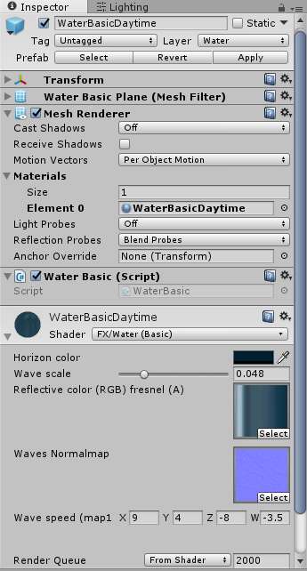

# Standard Assets - Water (Basic)

> Unity Standard Assets版本: 5.5.0f3 Personal

## Water (Basic) 简介及参数说明

Water(Basic)位于Assets\Standard Assets\Environment\Water (Basic)目录下。Water(Basic)提供简单的水特效，仅仅具有动态水波的效果。没有透明、反射、折射、浪花的效果。将Prefabs目录下的prefab拖入场景中即可使用。

## 实现过程

 使用纹理动画来模拟水波，在WaterBasic脚本中更改纹理的Offset。其实也可以在shader中获取时间直接计算Offset，见[MyCustomFXWaterBasic.shader](./MyCustomFXWaterBasic.shader)。